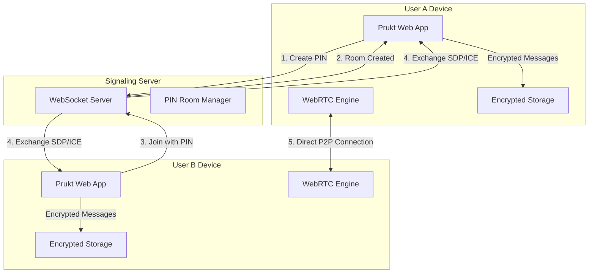

# 🔐 Prukt - Peer-to-Peer Encrypted Messaging Application

<div align="center">


[](https://choosealicense.com/licenses/mit/)
[](https://webrtc.org/)
[](https://en.wikipedia.org/wiki/End-to-end_encryption)
[](https://prukt.netlify.app)

**Zero Servers. No Accounts. Just Secure Communication.**

[Live Demo](https://prukt.netlify.app) • [Report Bug](https://github.com/SocialisticO4/PruKt/issues) • [Request Feature](https://github.com/SocialisticO4/PruKt/pulls)

</div>

---

## 📋 Table of Contents

- [About The Project](#about-the-project)
- [Key Features](#key-features)
- [Technology Stack](#technology-stack)
- [Architecture](#architecture)
- [Getting Started](#getting-started)
- [Deployment Guide](#deployment-guide)
- [Usage](#usage)
- [Security Implementation](#security-implementation)
- [API Documentation](#api-documentation)
- [Contributing](#contributing)
- [Team](#team)
- [License](#license)
- [Acknowledgments](#acknowledgments)

---

## 🎯 About The Project

Prukt is a revolutionary peer-to-peer messaging application that prioritizes user privacy above all else. Unlike traditional messaging apps that route messages through central servers, Prukt establishes direct connections between users using WebRTC technology. 

### Why Prukt?

- **True Privacy**: Messages never touch our servers - we literally cannot read them
- **No Registration**: No phone numbers, emails, or personal information required
- **PIN-Based Rooms**: Connect with just a 6-digit PIN, like joining a Zoom call
- **End-to-End Encryption**: Military-grade AES-256-GCM encryption
- **Zero Knowledge Architecture**: We don't store messages, metadata, or user information

---

## ✨ Key Features

### Core Functionality
- 🔐 **PIN-Based Connection**: Create or join rooms with 6-digit PINs
- 📡 **WebRTC P2P**: Direct peer-to-peer connections
- 🔒 **E2E Encryption**: AES-256-GCM with ECDH key exchange
- 💾 **Encrypted Local Storage**: Messages encrypted locally with PIN-derived keys
- 🔄 **Auto-Reconnection**: Resilient connection handling
- 📱 **Responsive Design**: Works seamlessly on all devices

### Security Features
- 🛡️ **Zero-Knowledge Architecture**: No server-side message storage
- 🔑 **Perfect Forward Secrecy**: New encryption keys for each session
- 🎭 **Anonymous Usage**: No user accounts or tracking
- 🔍 **Fingerprint Verification**: Visual security verification between peers
- ⏱️ **Ephemeral Sessions**: Connections end when you close the app

### User Experience
- 💚 **Security-First UI**: Green theme (#2E7D32) with trust indicators
- 📝 **Real-Time Typing Indicators**: See when peers are typing
- ✅ **Message Status**: Delivery and encryption confirmations
- 🌐 **Cross-Platform**: Works in any modern browser
- ⚡ **Instant Connection**: No setup or configuration required

---

## 🛠️ Technology Stack

### Frontend
```javascript
{
  "framework": "React 18 + TypeScript",
  "build": "Vite 5.0",
  "styling": "Tailwind CSS 3.4",
  "ui": "Shadcn/ui Components",
  "state": "TanStack Query",
  "routing": "React Router v6"
}
```

### P2P & Encryption
```javascript
{
  "p2p": "WebRTC (SimplePeer)",
  "encryption": "Web Crypto API",
  "keyExchange": "ECDH P-256",
  "symmetric": "AES-256-GCM",
  "storage": "IndexedDB (Dexie.js)"
}
```

### Backend (Minimal Signaling)
```javascript
{
  "server": "Express.js + Node.js",
  "websocket": "ws (WebSocket)",
  "hosting": "Railway (Backend) + Netlify (Frontend)",
  "signaling": "Custom P2P signaling protocol"
}
```

---

## 🏗️ Architecture

### System Architecture



### Encryption Flow

```
User A                               User B
   |                                    |
   |------ ECDH Public Key Exchange --->|
   |<----- ECDH Public Key Exchange ----|
   |                                    |
   |--- Derive Shared Secret (ECDH) ---|
   |                                    |
   |------ AES-256-GCM Encrypted ------>|
   |<----- AES-256-GCM Encrypted -------|
```

---

## 🚀 Getting Started

### Prerequisites

- Node.js 18+ and npm
- Modern browser (Chrome/Firefox/Edge)
- Git

### Installation

1. **Clone the repository**
```bash
git clone https://github.com/SocialisticO4/PruKt.git
cd PruKt
```

2. **Install dependencies**
```bash
npm install
```

3. **Set up environment variables**
```bash
# Create .env file
cp .env.example .env

# For development
echo "VITE_SIGNALING_WS_URL=ws://localhost:5000/p2p" > .env

# For production
echo "VITE_SIGNALING_WS_URL=wss://prukt-production.up.railway.app/p2p" > .env.production
```

4. **Run development server**
```bash
# Start both frontend and backend
npm run dev

# Frontend only
npm run dev:client

# Backend only
npm run dev:server
```

5. **Build for production**
```bash
npm run build
```

---

## 📦 Deployment Guide

### Option 1: Deploy to Railway (Backend) + Netlify (Frontend)

#### Backend Deployment (Railway)

1. **Push to GitHub**
```bash
git add .
git commit -m "Deploy Prukt"
git push origin main
```

2. **Deploy to Railway**
```bash
# Install Railway CLI
npm install -g @railway/cli

# Login and deploy
railway login
railway init
railway up
```

3. **Configure Railway**
- Go to [Railway Dashboard](https://railway.app)
- Set environment variables:
  - `P2P_ONLY=true`
  - `NODE_ENV=production`
- Generate domain under Settings → Networking

#### Frontend Deployment (Netlify)

1. **Build the frontend**
```bash
npm run build
```

2. **Deploy to Netlify**
```bash
# Install Netlify CLI
npm install -g netlify-cli

# Deploy
netlify deploy --prod --dir=dist/public
```

3. **Configure Netlify**
- Set build command: `npm run build`
- Set publish directory: `dist/public`
- Add environment variable:
  - `VITE_SIGNALING_WS_URL=wss://your-railway-url/p2p`

### Option 2: Single Service Deployment (Netlify with Functions)

1. **Configure netlify.toml**
```toml
[build]
  command = "npm run build"
  publish = "dist/public"
  functions = "netlify/functions"

[[redirects]]
  from = "/*"
  to = "/index.html"
  status = 200
```

2. **Deploy**
```bash
netlify deploy --prod
```

### Option 3: Docker Deployment

```dockerfile
# Dockerfile
FROM node:18-alpine
WORKDIR /app
COPY package*.json ./
RUN npm ci --only=production
COPY . .
RUN npm run build
EXPOSE 5000
CMD ["npm", "start"]
```

```bash
docker build -t prukt .
docker run -p 5000:5000 -e P2P_ONLY=true prukt
```

---

## 💬 Usage

### Creating a Secure Room

1. Open [Prukt](https://prukt.netlify.app)
2. Click **"Create Private Room"**
3. Share the 6-digit PIN securely with your contact
4. Wait for them to join
5. Verify the security fingerprint (optional but recommended)
6. Start chatting securely!

### Joining an Existing Room

1. Open [Prukt](https://prukt.netlify.app)
2. Click **"Join Existing Room"**
3. Enter the 6-digit PIN
4. Click **"Join"**
5. Verify the security fingerprint
6. Begin secure communication

### Security Best Practices

- ✅ Always verify fingerprints for sensitive conversations
- ✅ Share PINs through a separate secure channel
- ✅ Close the browser tab when finished to end the session
- ✅ Use incognito/private mode for extra privacy
- ✅ Connect only over trusted networks

---

## 🔒 Security Implementation

### Encryption Details

```typescript
// Key Generation
const keyPair = await crypto.subtle.generateKey(
  { name: "ECDH", namedCurve: "P-256" },
  true,
  ["deriveKey"]
);

// Message Encryption
const encrypted = await crypto.subtle.encrypt(
  { name: "AES-GCM", iv: randomIV },
  derivedKey,
  plaintext
);
```

### Security Features

| Feature | Implementation | Purpose |
|---------|---------------|---------|
| **E2E Encryption** | AES-256-GCM | Message confidentiality |
| **Key Exchange** | ECDH P-256 | Secure key agreement |
| **PIN Security** | PBKDF2 (100k iterations) | PIN strengthening |
| **Forward Secrecy** | Session-based keys | Past message protection |
| **Local Encryption** | IndexedDB + AES | Secure local storage |

### Threat Model

Protected Against:
- ✅ Man-in-the-middle attacks
- ✅ Server compromise
- ✅ Network eavesdropping
- ✅ Data breaches
- ✅ Government surveillance

Not Protected Against:
- ❌ Compromised endpoints
- ❌ Screen recording malware
- ❌ Physical device access
- ❌ Weak PINs (user responsibility)

---

## 📡 API Documentation

### WebSocket Events

```typescript
// Client → Server
interface ClientEvents {
  join: { pin: string; peerId: string };
  signal: { pin: string; signal: RTCSignal };
  leave: { pin: string };
}

// Server → Client
interface ServerEvents {
  peer_joined: { peerId: string };
  peer_left: { peerId: string };
  signal: { peerId: string; signal: RTCSignal };
  error: { message: string };
}
```

### REST Endpoints

```bash
GET  /              # Health check
GET  /status        # Server status
POST /report-error  # Error reporting
```

---

## 👥 Team

### Core Developer
- **GitHub**: [@SocialisticO4](https://github.com/SocialisticO4)
- **Role**: Full Stack Developer, Project Lead

### Contributors
Special thanks to our amazing contributors who helped build Prukt:

- **[@udayk-25](https://github.com/udayk-25)** - Technical Architecture & WebRTC Implementation
- **[@karthikveeramalla19-debug](https://github.com/karthikveeramalla19-debug)** - UI/UX Design & Frontend Development

### How to Contribute

We welcome contributions! Please see our [Contributing Guidelines](CONTRIBUTING.md) for details.

1. Fork the repository
2. Create your feature branch (`git checkout -b feature/AmazingFeature`)
3. Commit your changes (`git commit -m 'Add some AmazingFeature'`)
4. Push to the branch (`git push origin feature/AmazingFeature`)
5. Open a Pull Request

---

## 📄 License

This project is licensed under the MIT License - see the [LICENSE](LICENSE) file for details.

```
MIT License

Copyright (c) 2024 Prukt Team

Permission is hereby granted, free of charge, to any person obtaining a copy
of this software and associated documentation files (the "Software"), to deal
in the Software without restriction...
```

---

## 🙏 Acknowledgments

- [WebRTC Project](https://webrtc.org/) for P2P technology
- [Signal Protocol](https://signal.org/docs/) for encryption inspiration
- [Brave Talk](https://talk.brave.com/) for PIN-based room concept
- [OpenSSL](https://www.openssl.org/) for cryptographic standards
- [Railway](https://railway.app/) for hosting infrastructure
- [Netlify](https://www.netlify.com/) for frontend deployment
- [Shadcn/ui](https://ui.shadcn.com/) for beautiful components

---

## 📊 Project Stats


---

<div align="center">

**Built with ❤️ for Privacy**

[Website](https://prukt.netlify.app) • [Report Bug](https://github.com/SocialisticO4/PruKt/issues) • [Request Feature](https://github.com/SocialisticO4/PruKt/pulls)

</div>
